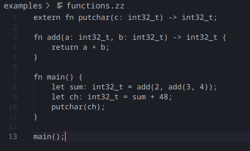

# zlang-support

This is the official VS Code extension for **zlang**, providing syntax highlighting and basic language support.

## Features

✨ **Syntax Highlighting**

- Highlights `fn`, `let`, `if`, `else`, `return`, `extern`
- Recognizes data types: `int`, `float`, `double`, `bool`, `void`, `string`, `uint64`, `uint32`, `uint8`
- Highlights numbers, strings, and comments

✨ **File Association**

- Automatically recognizes `.zlang` files

---

## Requirements

No special requirements. Just install the extension, and files with the `.zlang` extension will be highlighted automatically.

---

## Extension Settings

This extension does **not** contribute any additional settings (yet).

---

## Known Issues

- No IntelliSense or language server features (planned for a future version)
- No code formatting or linting support

---

## Release Notes

### 1.0.0

✅ Initial release of zlang-support
✅ Basic syntax highlighting for keywords, types, numbers, strings, and comments
✅ `.zlang` file association

---

## For more information

- [Visual Studio Code Extension API](https://code.visualstudio.com/api)
- [TextMate Grammar Guide](https://macromates.com/manual/en/language_grammars)

---

**Enjoy coding in zlang! 🚀**

⚡ *Tip:* You can preview this README in VS Code using `Ctrl+Shift+V` (Windows/Linux) or `Cmd+Shift+V` (macOS).
